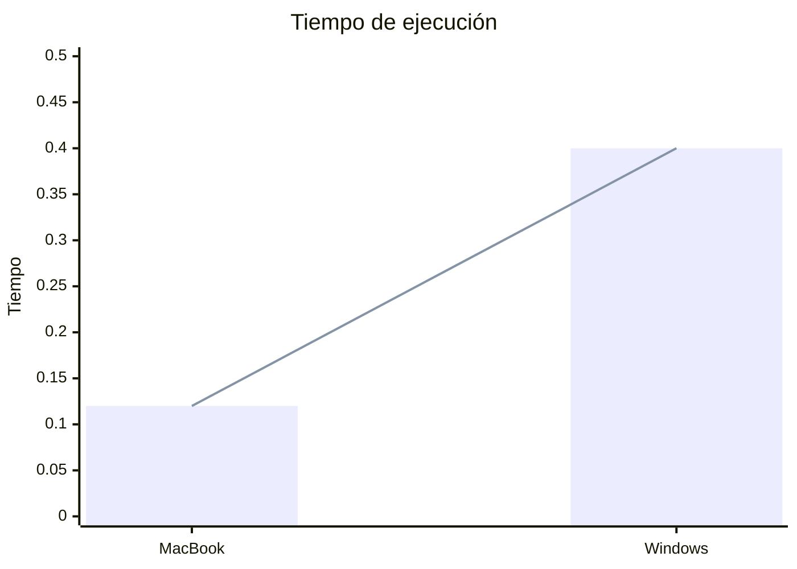

### Funcionamiento

El proceso comienza al ejecutar el archivo `main.py`, ubicado en la carpeta `src`. Este archivo llama a la función `etl()`, que valida la existencia de los archivos y la base de datos mediante las funciones `validate_excel_data()` y `validate_table()`. Si los archivos o la base de datos no existen, se crean automáticamente; de lo contrario, estos pasos se omiten.

> **Nota:** Simulé un diseño modular y reutilizable, similar a lo que hacen frameworks como Django y Laravel.

#### ¿Cómo funciona?

`main.py` invoca `validate_excel_data()`, que recorre el diccionario `sales_months` (definido en `sales.py`) utilizando un bucle `for`. Extrae el nombre de cada archivo y valida su existencia; si falta algún archivo, se crea.

- En `sales.py`, ubicado en `src/generation_data`, se encuentra `generate_one()`, que genera los datos y llama a las funciones necesarias para crear los archivos. Este archivo también contiene el diccionario `sales_months`.

Los archivos involucrados en `sales.py` son:

- `generate_sales_data.py`
- `create_directory.py`
- `create_file.py`

Luego, se valida la existencia de la base de datos. Si no existe, se crea automáticamente mediante `validate_table()`, que a su vez llama a `create_table()` en `operations.py`, creando una tabla con el nombre especificado.

Finalmente, `insert_data()` en `operations.py` inserta los datos en la base de datos. Durante todo el proceso, `connection_sqlite3.py` maneja la conexión y desconexión de la base de datos.

### Proceso ETL

#### Extract

En la etapa de extracción, se recuperan los datos de ventas desde archivos de Excel que contienen información sobre transacciones realizadas en diferentes meses. Se utiliza la biblioteca `pandas` para leer estos archivos y convertirlos en un DataFrame, facilitando la manipulación de los datos en Python.

#### Transform

Durante la etapa de transformación, se convierte el campo `sale_amount` de decimal (float) a entero para mejorar la precisión.

#### Load

En la etapa de carga, los datos transformados se insertan en la base de datos mediante `insert_data()` de `src/database/operations.py`. Esta función maneja la inserción masiva de datos y utiliza `commit()` para asegurar que los datos no se inserten en caso de error.

### Estructura de directorios

<pre>
challenge
├── data
│   ├── excel
│   │   ├── df_february.xlsx
│   │   ├── df_january.xlsx
│   │   └── df_march.xlsx
│   └── sqlite
│       └── challenge.sqlite3
├── myenv
├── src
│   ├── database
│   │   ├── connection_sqlite3.py
│   │   ├── operations.py
│   └── generation_data
│       ├── create_directory.py
│       ├── create_file.py
│       └── generate_sales_data.py
│   ├── sales.py
│   └── main.py
├── .env
├── .env.example
├── .gitignore
├── Readme.md
└── requirements.txt
</pre>

### Pruebas de ejecución
Para probar la optimización y medir el tiempo de ejecución, se obtuvieron las siguientes métricas:

|                    | Cantidad de registros | Tiempo de ejecución   |
| ------------------ | --------------------- | --------------------- |
| MacBook Air M2     | 102,292               | 0.14 segundos en promedio |
| Windows i7 8th Gen | 102,292               | 0.40 segundos en promedio |



### Guía de instalación de la aplicación

#### Clonar el repositorio

Primero, clona el repositorio de GitHub:

```sh
git clone https://github.com/Alejandro-Echavarria/challenge.git
cd challenge
```

#### Crear y activar el entorno virtual

Para mantener las dependencias del proyecto aisladas, crea un entorno virtual llamado `myenv`.

##### Crear el entorno virtual

```sh
python -m venv myenv
```

##### Activar el entorno virtual en Windows

```sh
myenv\Scripts\activate
```

##### Activar el entorno virtual en macOS y Linux

```sh
source myenv/bin/activate
```

#### Instalar dependencias

Con el entorno virtual activado, instala las dependencias necesarias utilizando el archivo `requirements.txt`:

```sh
pip install -r requirements.txt
```

#### Crear archivo .env con variables de entorno

Crea el archivo `.env`. Puedes copiar el archivo `.env.example` y renombrarlo. Debe contener lo siguiente:

```.env
DB_PATH='data/sqlite/'
CONNECTION_STRING='data/sqlite/challenge.sqlite3'
```

#### Ejecutar el archivo `main.py`

Para iniciar el proceso ETL, ejecuta el archivo `main.py` con el siguiente comando:

```sh
python src/main.py
```

#### Desactivar el entorno virtual

Cuando hayas terminado de trabajar en el proyecto, puedes desactivar el entorno virtual:

```sh
deactivate
```

> **Nota:** Cualquier inconveniente puedes contactarme [LinkedIn](https://www.linkedin.com/in/mechavarria-maet/) o whatsapp.